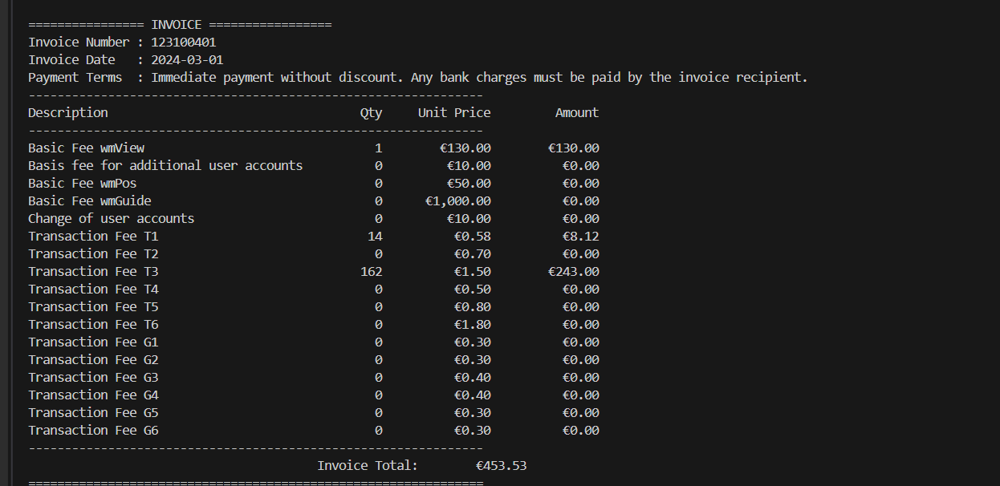

# AWS-Textract-Invoice-Parser
Extracts structured invoice data (header fields + line items) from PDFs and images using AWS Textract – AnalyzeExpense, with a FORMS fallback for missing headers. Handles multi-page invoices, merges page results, and prints a clean console report plus normalized JSON.

## What it does

Accepts files from your local drive (.pdf, .jpg, .jpeg, .png)

Uploads to your S3 bucket and runs Textract AnalyzeExpense (async)

(If needed) runs Textract FORMS to recover header KV pairs

Merges multi-page outputs, picks the primary doc, and sanitizes line items

Resolves tricky cases where unit price ↔ amount columns are swapped

Prints a pretty table to the console and writes:

*.textract_raw.json – raw Textract pages

*.parsed.json – parsed/merged docs

*_clean.json – final normalized object per assignment spec

## Project layout

├─ main.py                 # Orchestrator / CLI

├─ client.py               # AWS clients, S3 upload, Textract job helpers

├─ expense_parser.py       # Parse AnalyzeExpense & FORMS; line-item logic

├─ aggregater.py           # Merge docs by invoice number (if used)

├─ utils.py                # Dates, currency/qty parsing, JSON utils, env helpers

└─ .env                    # Your configuration (not committed)

## Requirements

Python 3.9+ recommended

An AWS account with permissions for:

textract:StartExpenseAnalysis, textract:GetExpenseAnalysis

textract:StartDocumentAnalysis, textract:GetDocumentAnalysis

s3:PutObject, s3:GetObject on your bucket

## Running

Process one or more files from your local drive:

python main.py "C:\path\to\invoice 01.pdf" "C:\path\to\invoice 05.pdf"
or
python main.py ./samples/invoice01.pdf ./samples/invoice05.png

Artifacts saved next to your input:

invoice_01.textract_raw.json

invoice_01.parsed.json

invoice_01_clean.json

## How it works (pipeline)

Local file → S3
client.upload_local_*_to_s3() uploads the file with a unique key (prefix + UUID).

AnalyzeExpense (async)
client.start_expense_job() → poll with wait_for_job() → fetch paginated results with fetch_all_pages().

Parse
expense_parser.parse_expense_documents() walks ExpenseDocuments:

Extracts header fields (invoice number/date/total/terms) from Textract types and labels

Extracts line items and chooses the best (unitPrice, amount) pair using quantity-aware scoring with soft hints and a safety swap if columns were reversed

Filters per-row values that simply repeat the invoice total

Merge pages / choose primary
If multiple docs are returned, aggregater.merge_documents_by_invoice_number() (if used) merges them; then choose_primary_document() selects a final representative.

FORMS fallback
If a header field is missing, StartDocumentAnalysis(FORMS) runs once and parse_forms_key_values() helps fill gaps (invoice number/date/terms).

Sanitize & print
sanitize_line_items() drops summary rows (Subtotal, Tax, etc.), fixes zero-qty noise, and computes missing fields only when they are actually missing (never overwriting values Textract provided).
main.print_invoice_report() displays the table; utils.save_json() writes artifacts.

## Supported inputs

PDF (multi-page supported)

JPG / JPEG / PNG (single or multi-page image sets as separate files)

